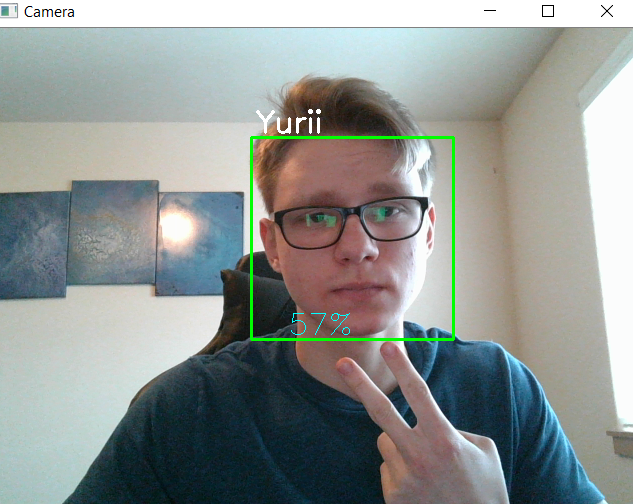

# FaceRecognition
My coursework on identifying people by their faces in the input video stream or video file. 
The program uses Viola-Jones algorithm.
# Algorithm steps:
1.	Selecting Haar-like features. 
2.	Creating an integral image. 
3.	Running AdaBoost training. 
4.	Creating classifier cascades.

# Interface:
1. Main menu:

2. Camera view:

2. Database menu:

2. Database logs & user list:

